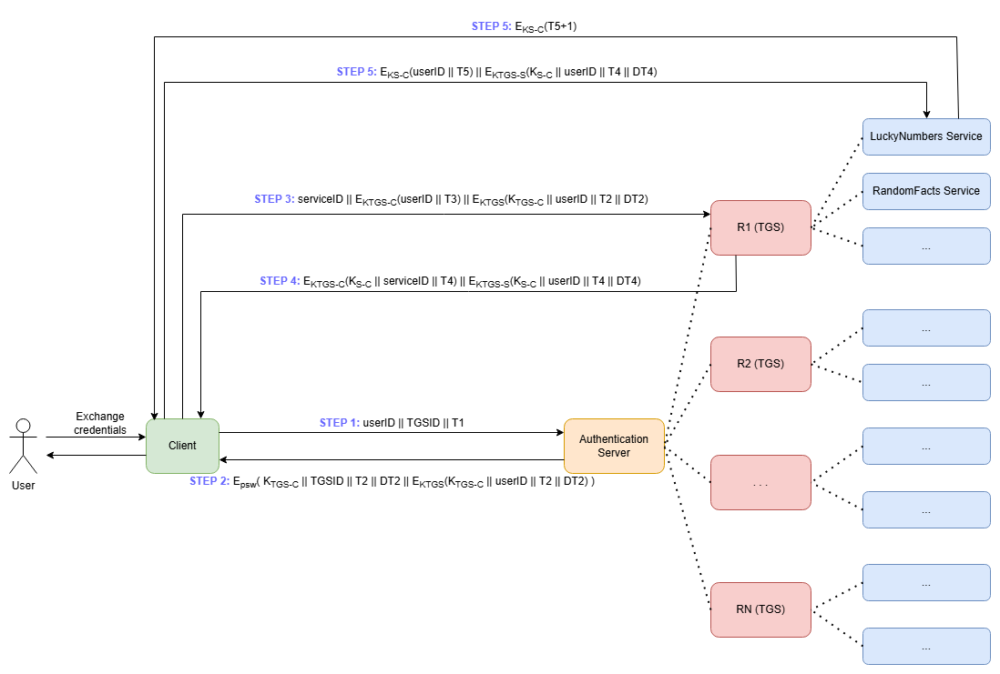

# 🔧 Kerberos DIY 🏷️
An imitation of the network-identification, ticket-based **Kerberos** protocol in a Java suite, from login within the secure client machine to interaction with the selected service once the protocol is completed.

## Preface 📝
This project was created solely for academic purposes. Specifically, to gain some practical experience with concepts otherwise seen only on a theoretical level (hash functions, key creation, encryption/decryption, ...).
As such, several of the choices made wouldn't be optimal for a non-sandbox environment. Take it as a way to visualise the Kerberos protocol step-by-step, or as an instrument to teach others.

### Entities Visual Representation 🖼️
In the following picture:
* `TGS` stands for Ticket-Gating Server
* `T1, T2, ...` are timestamps while `DT2, DT3, ...` are the deltas after which the response is deemed invalid and the protocol must restart
* `psw` is a key derived from the password of the user
* `K_TGS_C` or `TGS_C_K` is the first session key, used between the Client and the Selected TGS to communicate safely
* `KTGS` is a secret key shared between the Authentication Server and a specific TGS exclusively
* `K_S_C` or `S_C_K` is the second session key, used between the Client and the requested Service to communicate safely

⚠️ Currently, there is only 1 functional Realm and 1 functional Service belonging to said realm. Those are `R1` and `luckyNumbers` respectively.
### Classes Overview
- `mainClasses` package:
  - `AuthServer` is the Authentication Server, which handles steps 1 and 2 of the protocol
  - `TGS_R1` is an example of TGS, specifically the TGS for the realm R1. It handles steps 3 and 4 of the protocol.
  - `ServiceLuckyNumber` is an example of a service Server belonging to the realm R1. It handles steps 5 and 6 and, if they are successful, provides 'lucky' numbers upon user interaction.
- `utils` package:
  - `EncDecUtils` from the `utils` package: contains the functions used to create keys, encrypt and decrypt (SHA-256 + AES). The cryptographic functions use initialisation vectors (IVs) which are managed under-the-table by the `EncDecUtils` class.
  - `EndpointDetails` from the `utils` package: just a Model class to store data in a compact manner
  - `TimestampUtils` from the `utils` package: a series of utility functions to obtain, compare and parse timestamps and/or Date datatype

### Where and How to Run
Everything is printed on the _System.out_ for the user to see (no graphic interface). 

To run, launch all the servers first (Authentication Server, TGS Server, Service Server) and *then* launch the Client.

